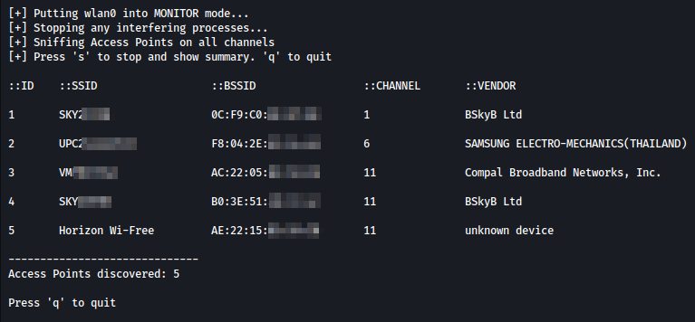

# Pyfi

**Read disclaimer and warnings below before using this tool**

Default operation:
- Enumerates local wireless access points and sniffs for connected clients

Additional options:
- Allow for targeted or blanket deauthentication of clients from specified wireless access point
- This portion of the project is for educational purposes only, in order to learn about
WiFi vulnerabilites, and steps sometimes taken by malicious actors when performing
MITM type attacks. Read the disclaimer below before using this tool.

### Technologies used:

- Python3
    - curses module for terminal UI
    - scapy module for packet capture, analysis and forging

### TODO:
- Source most up-to-date vendor database. Find a way to keep it updated.
- Incorporate all argparse parsed arguments from utils.py
- Fix bug when quitting during sniffing phase
- Add colours to UI

### DISCLAIMER:

1. This is a project I have created for educational purposes only.
The author does not condone or encourage malicious use of this tool.
Do not use this tool to influence any wireless network unless you have
full consent to do so from the owners and users of the network,
with their full knowledge of the possible effects. You are responsible for being sure your actions are not breaking the law in your jurisdiction.

2. Do not use this tool if you do not fully understand what it does.

3. The performance of this tool relies on your hardware. 
Some network cards or setups may not work, or may produce unexpected behaviour.

